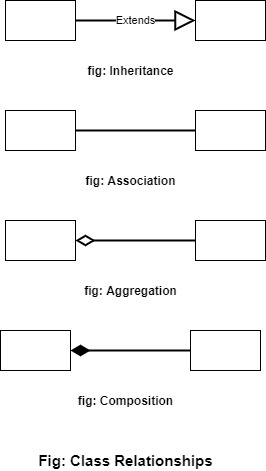
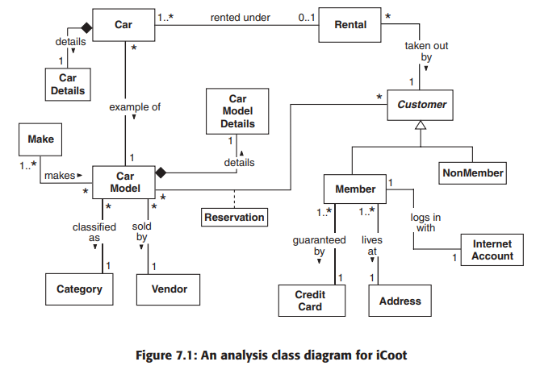
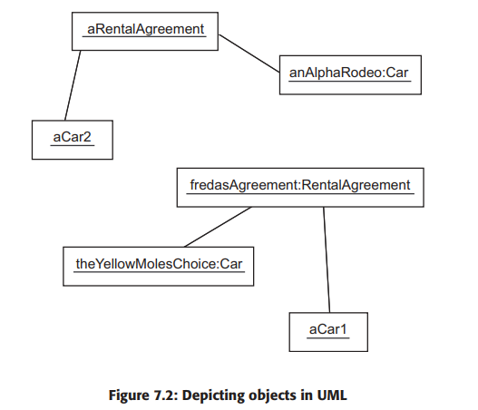
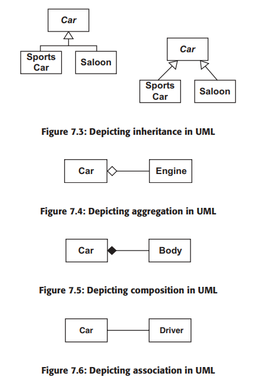

# Chapter 7 Analyzing the Problem

#### Analysis is the discovery of what system is going to handle.
- Decompose requirements into the essential elements and relationships.
- Modeling real world as objects.

#### An Analysis model has both static and dynamic parts.
- Static Analysis is done using Static Analysis Model using class diagram. Our Sponsors
will be able to confirm that our understanding of the business model is correct.

- Dynamic Analysis is done using Dynamic Analysis Model using Communication diagram. We
will be confident that our Analysis objects support the required system functionality.

---
## Two inputs to the Analysis:
  ##### 1. Business requirements Model
  ##### 2. System requirements Model

---

### Why do Analysis?
To design a solution before we understand the problem.

---

## Overview of the Analysis Process
1. Use the system requirements model to **find candidate classes** that describe the objects
that might be relevant to the system and **record them on a class diagram**.

2. **Find relationships (association, aggregation, composition and inheritance)** between the
classes.

3. **Find attributes** (simple, named properties of the objects) for the classes.

4. Walk through the system use cases, checking that they’re supported by the objects that
we have, **fine-tuning the classes, attributes and relationships** as we go – this use case
realization will produce operations to complement the attributes.

5. **Update the glossary and the non functional requirements as necessary** – the use cases
themselves should not need updating, although perhaps they will need some correcting.

---

## Static Analysis
It involves deciding the logical or physical parts and how they should be connected to each other.

#### 1. Finding Classes

- We have good source of possible candidates in the form of system use cases.

- Candidate Classes are often indicated by **nouns** in the use cases.

#### 2. Identifying Class relationships

There are four possible types of relationships:

1. Inheritance: A subclass inherits all of the attributes and behaviour of its superclass(es).

> Note: Inheritance describes the compile time relationship while other define run-time connection between objects.

2. Association: Objects of one class are associated with the objects of another class.

3. Aggregation: Strong Association- an instance of one class is made up of instances of another class.

4. Composition : Strong Association- the composed objects can't be shared by other objects and die with its composer.

> Frequency of these relations:
association > aggregation > inheritance > composition

#### 3. Drawing Class diagram

- Every class is is represented by a box with the class name inside(Bold if not drawing by hand.)

- If Class is abstract, the class name is italicized. Also, we can write keyword **{abstract}** above or to the left of the class name.

- Relationship between class diagram are shown as lines with various annotations.

> **Note:** In object diagrams, object are shown as boxes connected by links. Object names are underlined. Semicolon **:** is used to seperate name and class type of the object if shown in Object Diagram.

##### Few Examples from Book of Class Diagrams:

> Fig: An analysis class diagram for iCoot

> Fig: Depicting objects in UML

> Fig: Depicting association in UML

---

#### Multiplicity
All relationships except inheritance can indicate are either end the number of run-time objects that are allowed  to take part in the relationships.

- n: Exactly n.
- m..n: Any number in the range m to n (inclusive).
- p..*: Any number in the range p to infinity.
- *: Shorthand for 0..*.
- 0..1: Optional.

**Note:** For composition, the multiplicity at the composer’s end is always 1 because, according to the UML rules, a composed object can’t be shared among composites – thus a multiplicity would be redundant in this case. In other cases, if no multiplicity is shown, we must assume that it has not been specified, or that it is simply not known at this stage. It would be wrong to assume that a missing multiplicity implied some default value, such as 1.

**Note**: Difference between aggregation and composition is subtle.

#### Association Labels, Roles and Comments
- Labels : All relationships, except inheritance, can be given an association label, indicating the nature of the association
- Roles: As well as association names, we can show roles. A role indicates the part played by an object in the association – the role is shown as a label near the object that plays the role.
- Comments: an arbitrary piece of text enclosed in an icon that looks like a piece of paper, connected to the relevant part of the diagram by means of a dashed line.

---

## 4. Attributes
In UML, each attribute can be given a type, which is either a class or a primitive. If we choose to specify a type, it should be shown to the right of the attribute
name, after a colon.

Note:  Be guided by your model: if it seems to be an attribute, draw it as an attribute; if it appears to be an association, draw it as an association.

## 5. Association Classes
An association class represents attributes and operations that exist only because the association exists: the attributes and operations are not tied to the objects at either end of the association.

## 6. Tangible Vs Intangible Objects
Often, you will find yourself modeling an intangible object, such as a product described in a catalog, and a separate tangible object, such as the actual item that is delivered to your door. The object in the catalog describes the properties of something that you could order from the supplier, but which hasn’t necessarily been manufactured yet. The object that arrives at your door definitely has been manufactured, it is an instance of the type of product described in the catalog. Typically, there are many tangible objects for each intangible one.

> It is a common mistake to model tangible and intangible pairs as a single object.

The introduction of a class with two distinct sets of responsibilities
should be ringing alarm bells already – such classes are said to have weak cohesion: their responsibilities do not form a single clump.

---
