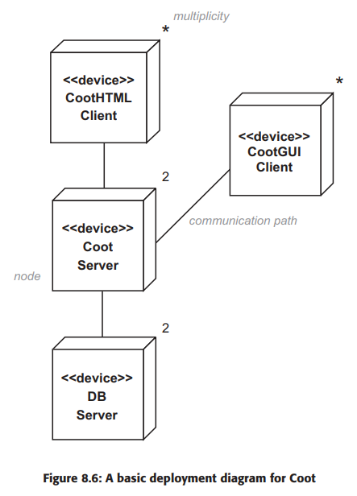

# Chapter 8 : Designing the System Architecture

## 1. Introduction

Designing is about inventing the solution.
During design phase, we make certain technology choices (programming languages and DBMSs.)

---

## 2. Design Priorities

Within that architecture, we perform detailed design for the most
important use cases and partial design for the less important ones. Between increments, we
adjust the priorities, the urgencies and the design, as appropriate.

---

## 3. Steps in System Design

Steps are:
1. Choose a System Technology:
2. Making Technology Choices:
3. Designing a concurrency policy:
4. Designing a Security policy:
5. Choosing Subsystem Partition
6. Partitioning Subsystem into layers or other subsystems
7. Deciding how machines, subsystems and layers will communicate

---

## 4. Choosing a Networked System Topology

1. One-Tier Architecture:
  - Mainframe Model aka one-tier architecture.
  - Has no network in modern sense of networking
  - It is simple to setup

2. Two-Tier Architecture:
  - aka Client-Server architecture
  - Mini computers and workstations were introduced as client side
  - File Server, Midicomputer were introduced as server side
  - Introduced faster network
  - Introduced sophisticated graphics capabilities and window systems

3. Three-Tier Architecture:
  - Seperates **user-interface**, **program logic** and **data** in networked systems
  - Three tier -
    - Desktop Computers -> Client tier : presents user interface to the users.

    - Server -> Middle tier : aka. Business Logic tier, runs multithreaded program code and uses large processing power and memory.

    - Mainframe, Server -> Data tier : provides safe concurrent access to it.

    ### 1. Benefits of Three-Tier Architecture:

    1. Separation of concerns
    2. Using right machines for the job
    3. Improved performance : load balancing
    4. Improved Security
    5. Protection of investment
    6. Flexibility
    7. Accommodation of different types of client

4. Personal computers

5. Network computers

6. The Internet and WWW

7. Intranets

8. Extranets and VPNs:

    - Allows information to pass from firewall to firewall.

    - Uses Strong encryption to protect the information as it passes over the Internet.

9. Client-Server vs Distributed Architecture

  - Distributed also known as peer to peer architecture; grid computing

  - Eg. of Client Server architecture is E-commerce Model

  - Client-Server easier to build while Distributed is better at performance

10. Depicting Network Topology in UML

  System architectures can be depicted in UML on a **deployment diagram**.
  Simple deployment diagram shows only *nodes*, *communication path*, and *multiplicities*.

  

  

---

## 5. Designing for Concurrency

---
## 6.  Designing for Security
---
## 7. Partitioning Software
---

> Merging two chapter into one. Need to split them later when skeleton is complete.

---

# Chapter 9 : Choosing Technologies

## 1. Introduction
---
## 2. Client Tier Technologies
---
## 3. Client Tier to Middle Tier Protocols
---
## 4. Middle Tier
---
## 5. Middle Tier to Data Tier Technologies
---
## 6. Other Technologies
---
## 7. Typical Front-End Configurations  
---
## 8. Back-End Configurations
---
## 9. Java E-Commerce Configurations
---
## 10. UML Packages
---
